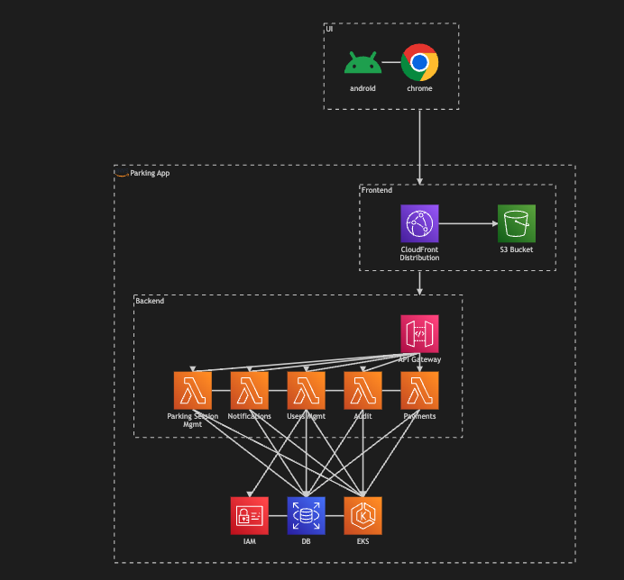

# Parking App

## Table of Contents

1. [Introduction](#introduction)
2. [Frontend Development and Deployment Report](#frontend-development-and-deployment-report)
3. [Backend API Development and Deployment Report](#backend-api-development-and-deployment-report)
4. [Diagrams](#diagrams)
   - [Infrastructure Diagram](#infrastructure-diagram)
   - [ER Diagram for the Database](#er-diagram-for-the-database)
   - [API and Frontend Flow Diagram](#api-and-frontend-flow-diagram)
5. [Conclusion](#conclusion)

---

## Introduction

This document presents the technical analysis, design, and deployment strategy for both the frontend and backend APIs of the Municipal Parking Management Application. It includes detailed reports on technology choices, development practices, hosting strategies, integration with external systems, and high availability & resilience measures.

---

## Frontend Development and Deployment

### 1. Overview

The frontend of the application is developed for both web and mobile platforms to provide a responsive and high-performance user experience. This section details the technology stack, development practices, hosting, and deployment strategies.

### 2. Web Frontend Development

#### 2.1 Technology Stack
- **Languages:** JavaScript/TypeScript
- **Framework:**  
  - *React* is recommended due to its component-based architecture, robust ecosystem, and strong community support.  
  - Alternatively, *Angular* can be used for a more opinionated structure.
- **State Management:** Redux or Context API (with React Query for server state)
- **Routing:** React Router (for React) or Angular Router (for Angular)
- **Styling:** CSS-in-JS (Styled Components, Emotion) or utility frameworks like Tailwind CSS
- **Build Tools:** Webpack or Vite
- **Testing:** Jest and React Testing Library (or Karma/Protractor for Angular)

#### 2.2 Development Practices
- **Component-Driven Development:** Create reusable UI components.
- **Responsive Design:** Utilize modern CSS (Flexbox, Grid) and media queries.
- **PWA Capabilities:** Implement offline support, service workers, and home screen installation.

### 3. Mobile Frontend Development

#### 3.1 Technology Stack
- **Frameworks:**  
  - *React Native* is recommended for shared JavaScript/TypeScript code between web and mobile.
  - Alternatively, *Flutter* can be used for a natively compiled solution.
- **Navigation:** React Navigation (React Native) or Flutter Navigator (Flutter)
- **State Management:** Redux, Context API, or MobX (for React Native)
- **Styling:** Styled Components (React Native) or Flutter’s widget system
- **Testing:** Detox for end-to-end testing, along with Jest and platform-specific unit tests

#### 3.2 Development Practices
- **Code Sharing:** Reuse business logic and data models between web and mobile.
- **User Experience:** Adhere to platform-specific design guidelines (Material Design for Android, Human Interface Guidelines for iOS).

### 4. Hosting and Deployment

#### 4.1 Static Content Hosting
- **Object Storage & CDN:**  
  - Use AWS S3 (with CloudFront), Google Cloud Storage (with Cloud CDN), or Azure Blob Storage (with Azure CDN) for hosting static assets.

#### 4.2 CI/CD Pipeline
- **Automation Tools:** GitHub Actions, GitLab CI/CD, or Jenkins for building, testing, and deploying.
- **Containerization:** Use Docker for SSR or dynamic web applications deployed on Kubernetes.

#### 4.3 High Availability and Resilience
- **CDN Distribution:** Global asset delivery to handle traffic spikes.
- **Monitoring & Logging:** Integrate with AWS CloudWatch, Datadog, Prometheus, or Grafana.
- **Auto-Scaling:** Configure auto-scaling for both frontend and backend APIs.
- **Disaster Recovery:** Utilize blue/green or canary deployments, regular backups, and multi-zone deployments.

### 5. Integration with Backend APIs

- **Communication:** Use RESTful endpoints via the API Gateway.
- **Authentication:** Secure token-based authentication (JWT) integrated with Identity Management (Keycloak/Auth0).
- **Error Handling:** Implement retry strategies and exponential backoff for API calls.
- **Data Synchronization:** Use Axios/Fetch API for HTTP requests and React Query for caching.

---

## Backend API Development and Deployment

### 1. Overview

The backend comprises multiple microservices, exposed via a central API Gateway, that manage core functionalities such as parking session management, payments, notifications, user and role management, and auditing. This section details the architecture, technology stack, database management, deployment, and security measures.

### 2. Technology Stack and Architecture

#### 2.1 Languages and Frameworks
- **Languages:**  
  - *Java (Spring Boot)* for enterprise-grade applications.
  - *Node.js (NestJS)* for a modular, scalable solution using TypeScript.
- **Frameworks:**  
  - *Spring Boot* for robust RESTful API development and integration.
  - *NestJS* for a dependency-injected, modular structure.

#### 2.2 API Gateway
- **Options:** Kong, NGINX, or AWS API Gateway.
- **Responsibilities:**
  - Routing client requests.
  - Enforcing security policies (token validation, rate limiting).
  - Centralized logging and monitoring.

#### 2.3 Microservices Overview
- **Parking Session Management:**  
  - Handles creation, tracking, and termination of parking sessions.
  - Uses SQL databases for persistence and Redis for caching.
- **Payments Service:**  
  - Integrates with external providers (e.g., MercadoPago) for transactions.
- **Notifications Service:**  
  - Sends alerts via SMS, email, or push notifications using asynchronous messaging (RabbitMQ/Kafka).
- **User and Role Management:**  
  - Manages user authentication and authorization, integrated with IAM.
- **Audit and Logging Service:**  
  - Captures system events for security compliance and troubleshooting.

### 3. Database and Data Management

#### 3.1 Database Systems
- **Relational Database:** PostgreSQL/MySQL for core data (users, transactions, sessions).
- **Caching Layer:** Redis for session data, tokens, and high-frequency queries.

#### 3.2 Data Access Patterns
- **ORM/ODM:**  
  - Hibernate with Spring Boot or TypeORM with NestJS.
- **Connection Pooling & Caching:**  
  - Optimize database access with pooling and caching strategies.

### 4. Deployment and Infrastructure

#### 4.1 Containerization and Orchestration
- **Containers:** Docker for packaging microservices.
- **Orchestration:** Kubernetes (managed services like AWS EKS, GKE, or Azure AKS).
- **Serverless:** AWS Lambda or Azure Functions for event-driven tasks.

#### 4.2 CI/CD Pipeline
- **Tools:** GitHub Actions, GitLab CI/CD, or Jenkins.
- **Deployment Strategies:** Blue/Green or Canary deployments.
- **Container Registries:** Docker Hub, AWS ECR, or Google Container Registry.

#### 4.3 High Availability and Resilience
- **Load Balancing:** Use Kubernetes Ingress controllers and API Gateways.
- **Auto-Scaling:** Horizontal pod auto-scaling based on metrics.
- **Monitoring & Logging:** Prometheus, Grafana, and the ELK Stack.
- **Disaster Recovery:** Regular backups and multi-zone deployments.

### 5. Security Considerations

#### 5.1 API Security
- **Authentication/Authorization:** JWT with OAuth2/OpenID Connect via IAM.
- **Encryption:** Use HTTPS/TLS for data in transit; encrypt data at rest.
- **Input Validation:** Sanitize all inputs to prevent injection attacks.
- **Rate Limiting:** Implement rate limiting and throttling.

#### 5.2 Infrastructure Security
- **Network:** VPCs, security groups, and firewalls.
- **Secrets Management:** AWS Secrets Manager or HashiCorp Vault.
- **Audit Logging:** Continuously monitor system activities.

### 6. Integration with External Systems

#### 6.1 Payment Providers
- **Secure RESTful Integration:** HTTPS with error handling and retries.

#### 6.2 Billing and Invoicing
- **Asynchronous Communication:** Use webhooks or message queues.

#### 6.3 Third-Party Authentication
- **IAM Integration:** Seamless integration with Keycloak/Auth0 using OAuth2/OpenID Connect.

### 7. API Design and Documentation

#### 7.1 API Design
- **RESTful Principles:** Stateless, cacheable, uniform interface.
- **Versioning:** Maintain backward compatibility.
- **Error Handling:** Standardize error responses.

#### 7.2 Documentation
- **Tools:** Swagger/OpenAPI for interactive documentation.
- **Developer Portal:** Provide comprehensive API documentation and SDKs.

---

## Diagrams

Below are the diagrams generated using Mermaid.

### Infrastructure Diagram

```mermaid
architecture-beta

group ui[UI]
group awsApp(logos:aws)[Parking App]
group frontend[Frontend] in awsApp
group backend[Backend] in awsApp

service android(logos:android-icon)[android] in ui
service chrome(logos:chrome)[chrome] in ui
service api(logos:aws-api-gateway)[API Gateway] in backend
service lambda1(logos:aws-lambda)[Parking Session Mgmt] in backend
service lambda2(logos:aws-lambda)[Notifications] in backend
service lambda3(logos:aws-lambda)[Users Mgmt] in backend
service lambda4(logos:aws-lambda)[Audit] in backend
service lambda5(logos:aws-lambda)[Payments] in backend
service s3(logos:aws-s3)[S3 Bucket] in frontend
service cdn(logos:aws-cloudfront)[CloudFront Distribution] in frontend
service db(logos:aws-rds)[DB] in awsApp
service iam(logos:aws-iam)[IAM] in awsApp
service eks(logos:aws-eks)[EKS] in awsApp

junction junctionCenter
junction junctionLeft
junction junctionRight


%% Conexiones

%% UI --> CloudFront --> S3 --> API
android:R -- L:chrome
chrome{group}:B --> T:cdn{group}
cdn:R --> L:s3
cdn{group}:B --> T:api{group}

%% Forzar la alineación horizontal de los Lambdas
lambda1:R -- L:lambda2
lambda2:R -- L:lambda3
lambda3:R -- L:lambda4
lambda4:R -- L:lambda5

%% API --> Lambdas
api:B --> T:lambda1
api:B --> T:lambda2
api:B --> T:lambda3
api:B --> T:lambda4
api:B --> T:lambda5

%% Lambdas --> DB, IAM, EKS
lambda1:B --> T:db
lambda2:B --> T:db
lambda3:B --> T:db
lambda4:B --> T:db
lambda5:B --> T:db

lambda1:B --> T:eks
lambda2:B --> T:eks
lambda3:B --> T:eks
lambda4:B --> T:eks
lambda5:B --> T:eks

%% lambda1:B --> T:iam
%% lambda2:B --> T:iam
lambda3:B --> T:iam

iam:R -- L:db
db:R -- L:eks
```

### API and Frontend Flow Diagram

### ER Diagram for the Database

## Conclusion
The combined technical approach detailed in this repository provides a comprehensive blueprint for the development, deployment, and operation of both the frontend and backend APIs of the Municipal Parking Management Application. By leveraging modern frameworks, robust CI/CD pipelines, container orchestration, and a strong security posture, the solution is designed to be scalable, highly available, and resilient to future growth and integration needs.

